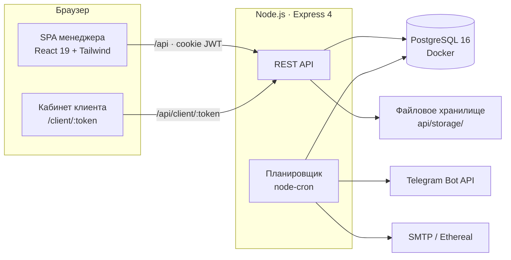
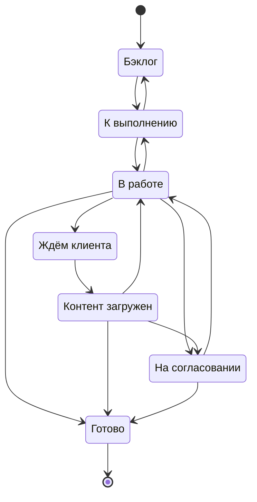
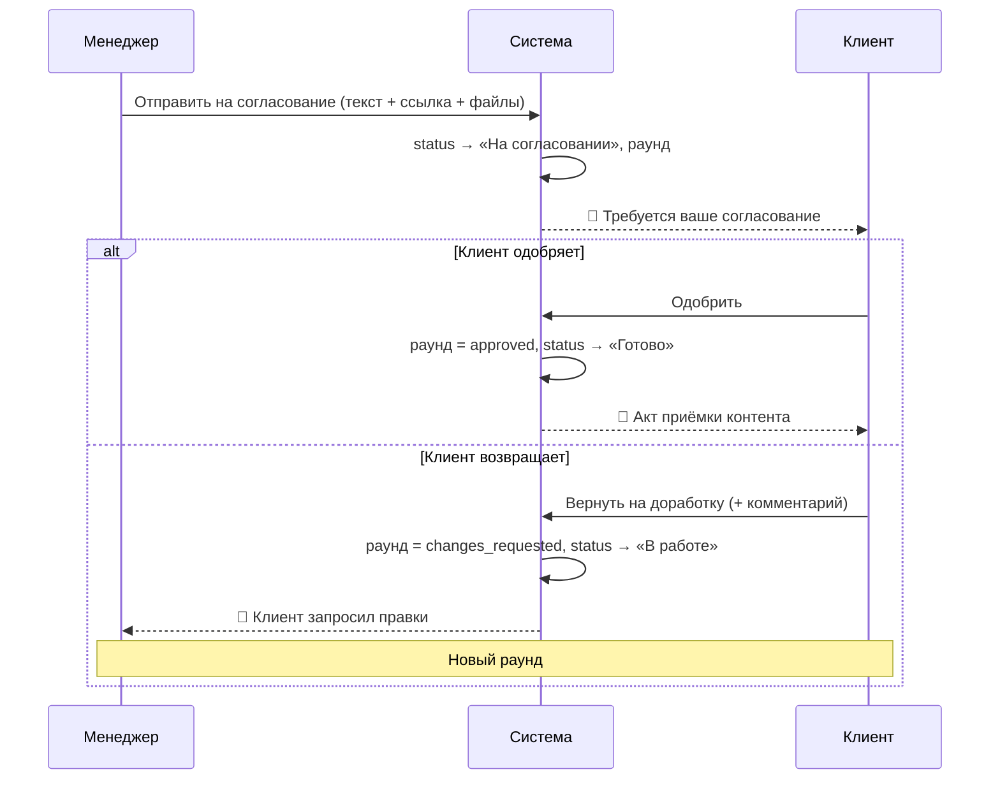

<div align="center">

# 🌊 Прозрачный поток

### Цифровая система взаимодействия с клиентами для digital-агентства

*Превращает «дожимание клиента в мессенджерах» в прозрачное партнёрство: клиент видит проект через персональную ссылку без регистрации, менеджер — Канбан-доску с защитой от потерянных задач и автоматическими напоминаниями.*


</div>

---

## 📌 Коротко о проекте

**«Прозрачный поток»** — дипломный прототип для digital-агентства **«АденаДиджитал»**. Система решает корневую проблему отрасли: **непрозрачность проектной работы для заказчика** и **операционное выгорание менеджеров** на ручном «дожимании» клиента.

- 👤 **Клиенту** — по персональной ссылке без регистрации полное окно в проект: задачи, зависимости в виде Mind Map, прогресс, и что требуется лично от него.
- 🧭 **Менеджеру** — Канбан-доска, конечный автомат состояний (защита от «потерянных» задач), портфель из нескольких проектов и **автоматические каскадные напоминания** клиенту.
- ⚖️ **Агентству** — юридически выверенная модель (акт приёмки контента, синхронизация уведомлений с правовым основанием для сдвига сроков) и брендированный клиентский портал как дополнительная точка касания.

> Главная ценность — не автоматизация переписки, а **смена модели взаимоотношений: с реактивного микроменеджмента на проактивное партнёрство.**

---

## 🎯 Проблема

В проектной работе агентства основной источник потерь находится **не внутри команды, а на стыке агентства и заказчика**:

| | Боль |
|---|---|
| **Клиент** | Не понимает, на каком этапе проект, что в работе, что зависит от чего, что требуется **от него** и к какому сроку. |
| **Менеджер** | Не знает, когда клиент откликнется; держит в голове десятки контекстов; вынужден периодически «дожимать» заказчика в мессенджерах. |
| **Итог** | Простои, кассовые разрывы, выгорание людей, испорченные отношения. |

---

## 💡 Решение и ключевые возможности

### Для менеджера (PM)
- ✅ **Канбан-доска** с drag-and-drop (`@dnd-kit`), 6 колонок статусов.
- ✅ **Конечный автомат состояний (FSM)** — сервер не даёт сделать невалидный переход (HTTP 409).
- ✅ **Mind Map зависимостей** между задачами (`@xyflow/react`).
- ✅ **Портфель проектов** — несколько проектов сразу, бейджи проекта на карточках, фильтры.
- ✅ **Цикл согласования** — отправка результата клиенту, итеративные раунды правок, акт приёмки.
- ✅ **Центр уведомлений** внутри приложения (комментарии, согласования, эскалация, акты, контент, предложения).
- ✅ **Роли и доступ** — bcrypt + JWT в httpOnly-cookie, права проверяются на сервере.

### Для клиента (без регистрации)
- ✅ **Кабинет проекта по постоянной ссылке** — read-only Канбан + Mind Map + база знаний.
- ✅ **Комментарии «как в Google Docs»** — к выделенному фрагменту описания (anchor).
- ✅ **Отправка материалов** — загрузка файлов прямо в задачу.
- ✅ **Согласование результата** — «Одобрить» или «Вернуть на доработку».
- ✅ **Предложить задачу / задать вопрос** — попадают в инбокс менеджера.
- ✅ **Magic Link** — одноразовая ссылка для загрузки материалов по конкретной задаче.

### Автоматизация и право
- ✅ **Каскадные напоминания** — `node-cron` шлёт клиенту 3 уровня уведомлений по рабочим дням.
- ✅ **Telegram-бот** (реальный, через BotFather) + **Email** (SMTP / Ethereal-fallback).
- ✅ **Акт приёмки контента** — письмо клиенту в момент юридической передачи результата.
- ✅ **Расчёт по рабочим дням** — третье уведомление приходит к моменту, когда наступает правовое основание для сдвига срока (оговорка о динамической пролонгации).

---

## 🏗️ Архитектура



- **Фронтенд** — одностраничное приложение на React 19. Всё состояние — в `App.jsx` через `useState` (без Redux/Zustand — намеренно, для прозрачности и простоты защиты).
- **Бэкенд** — Express + плоский SQL через `pg.Pool` (без ORM). Каждая мутация — в одной транзакции, чтение DTO — после `COMMIT`.
- **Прокси** — Vite в dev проксирует `/api → :3001`, поэтому фронт и бэк живут на одном origin (cookie работает без CORS-боли).

### Конечный автомат состояний (FSM)

Сервер — последняя инстанция: даже если фронт пропустит запрещённый переход, бэкенд вернёт `409`.



> **Admin-override:** администратор может откатить задачу из `Готово` в любой статус (исправление ошибок).
> **`На согласовании`** — особый статус: войти в него можно только через действие «Отправить на согласование» (создаётся раунд), а выйти — через решение клиента или отзыв менеджера. Голый перевод статуса в `review` запрещён, чтобы не было «пустых» согласований.

### Цикл согласования (Approval Loop)

Главный «глагол» агентской работы — **согласовать**. Моделируется как итеративная сущность (несколько раундов), а не флаг статуса, — это даёт честный аудит и привязывает акт к конкретному одобренному раунду.



### Каскадные уведомления

`node-cron` периодически (по умолчанию ежечасно) проходит по задачам в статусе «Ждём клиента» и эскалирует обращение по **рабочим дням**:

| Уровень | Триггер (раб. дни в ожидании) | Каналы | Тон |
|:---:|:---|:---|:---|
| 1 | 0 | Telegram | Дружеское напоминание |
| 2 | +2 | Telegram + Email | Деловое |
| 3 | +4 | Telegram + Email | Формальное + ссылка на пункт договора |
| — | +5 | внутреннее событие для PM | Каскад исчерпан, нужен ручной контакт |

**Идемпотентность:** один тик не пошлёт уведомление дважды в одном окне; неуспешная отправка тоже считается «уровень пройден» (иначе отключённый канал зациклил бы каскад). Гонки параллельных тиков сняты `SELECT … FOR UPDATE`.

> 🧪 **Демо-режим для защиты:** в дропдауне колокольчика у администратора есть кнопки «+3 / +5 / +8 дней» — они сжимают 5-дневный каскад в секунды через подмену `virtualNow`, без правки таймстампов в БД.

---

## 🧰 Стек технологий

### Frontend
| Технология | Версия | Роль |
|---|---|---|
| **React** | 19 | UI-фреймворк |
| **Vite** | 8 | Сборка, dev-сервер, прокси `/api → :3001` |
| **Tailwind CSS** | 4 (PostCSS) | Утилитарная стилизация |
| **@dnd-kit** | latest | Drag-and-drop на Канбан-доске |
| **@xyflow/react** | latest | Mind Map зависимостей задач |
| **Lucide React** | latest | Иконки |

### Backend
| Технология | Версия | Роль |
|---|---|---|
| **Node.js** | ≥ 20 | Среда выполнения (`node --watch`, без nodemon) |
| **Express** | 4 | HTTP-фреймворк |
| **PostgreSQL** | 16 (Docker) | База данных |
| **pg** | 8 | Клиент Postgres (`pg.Pool`), плоский SQL без ORM |
| **bcrypt** | 5 | Хеширование паролей |
| **jsonwebtoken** | 9 | JWT (HS256) в httpOnly-cookie |
| **multer** | 2 | Загрузка файлов (multipart) |
| **node-cron** | 4 | Планировщик каскадных уведомлений |
| **nodemailer** | 8 | Email (SMTP + Ethereal-fallback) |

---

## 🗄️ Модель данных (ключевые таблицы)

| Таблица | Назначение |
|---|---|
| `users` | Сотрудники агентства (роли `admin` / `pm` / `viewer`) |
| `clients` | Клиенты (+ `telegram_chat_id`, `support_chat_url`) |
| `projects` | Проекты (+ постоянный `client_view_token` для кабинета) |
| `tasks` | Задачи (FSM-статус, тег, дедлайн, magic-link, флаг «внутренняя») |
| `task_dependencies` | Зависимости задач (рёбра Mind Map) |
| `task_assignees` | Исполнители |
| `task_files` | Файлы (привязка к задаче и, опционально, к раунду согласования) |
| `task_comments` | Комментарии (+ `anchor` — якорь на фрагмент описания) |
| `task_approvals` | **Раунды согласования** (round, статус, решение клиента) |
| `task_events` | Аудит-лог: история, статусы, уведомления, акты — источник центра уведомлений |
| `task_suggestions` | Предложения задач от клиента |
| `notification_reads` | Отметки «прочитано» для PM и клиента |

Схема — append-only миграции в `api/migrations/*.sql`, отслеживаются в `schema_migrations`.

---

## 🔌 API (выборка)

| Метод | Путь | Доступ | Назначение |
|---|---|:---:|---|
| `POST` | `/api/auth/login` | — | Логин, ставит httpOnly-cookie |
| `GET` | `/api/tasks` | 🔒 | Список задач (DTO для фронта) |
| `POST` | `/api/tasks/:id/transition` | 🔒 | Смена статуса (FSM-валидация) |
| `POST` | `/api/tasks/:id/submit-review` | 🔒 | Отправить на согласование (раунд + файлы) |
| `POST` | `/api/tasks/:id/request-client` | 🔒 | Запросить материалы (статус → ждём, magic-link) |
| `GET` | `/api/guest/:token` | 🌐 | Гостевая страница загрузки по magic-link |
| `GET` | `/api/client/:token` | 🌐 | Кабинет клиента по постоянному токену |
| `POST` | `/api/client/:token/tasks/:id/approval/approve` | 🌐 | Клиент одобряет результат |
| `POST` | `/api/client/:token/tasks/:id/approval/changes` | 🌐 | Клиент возвращает на доработку |
| `GET` | `/api/notifications` | 🔒 | Лента центра уведомлений |
| `POST` | `/api/admin/trigger-notifications` | 🔒 admin | Ручной тик каскада (демо `virtualNow`) |
| `GET` | `/api/health` | — | Здоровье API + статус планировщика и каналов |

🔒 — нужна сессия PM (cookie). 🌐 — публично по неугадываемому токену.

---

## 🚀 Быстрый старт

**Требования:** Node.js ≥ 20, Docker Desktop.

```bash
# 1. База данных (PostgreSQL 16 в Docker)
docker compose up -d

# 2. Бэкенд
cd api
npm install
npm run db:reset      # миграции + сид демо-данных
npm run dev           # Express на http://localhost:3001

# 3. Фронтенд (в новом терминале, из корня репозитория)
npm install
npm run dev           # Vite на http://localhost:5173
```

Открыть **http://localhost:5173** и войти под демо-аккаунтом.

> 💡 **Один клик:** в корне есть `start-demo.bat` (Windows) — поднимает Postgres, API, Vite и публичный туннель `cloudflared` в отдельных окнах и выдаёт ссылку, которой можно поделиться без своего домена.

### 👥 Демо-аккаунты
| Email | Пароль | Роль |
|---|---|---|
| `admin@adena.local` | `admin123` | Администратор (откатывает «Готово») |
| `pm@adena.local` | `pm123` | Менеджер |
| `mentor@adena.local` | `mentor123` | Менеджер |

---

## 🗂️ Структура проекта

```
transparent-flow/
├── src/                      # Фронтенд (React 19)
│   ├── App.jsx               # Корень: состояние, обработчики, layout
│   ├── api/client.js         # Тонкий клиент над fetch
│   ├── components/
│   │   ├── KanbanBoard.jsx       # Доска + drag-and-drop
│   │   ├── TasksMindMapView.jsx  # Граф зависимостей
│   │   ├── task-modal/           # Модалка задачи (PM + клиентский режим)
│   │   ├── client/               # Кабинет клиента
│   │   └── notifications/        # Центр уведомлений
│   ├── theme/taskStyles.js   # Цветовые карты статусов/тегов/проектов
│   └── utils/taskWorkflow.js # FSM (зеркало бэкенда)
│
├── api/                      # Бэкенд (Express)
│   ├── migrations/*.sql      # Append-only миграции
│   ├── scripts/              # migrate.js, seed.js
│   └── src/
│       ├── server.js         # Сборка приложения, /api/health
│       ├── routes/           # auth, tasks, client, guest, notifications, admin…
│       ├── services/         # taskService, approvalService, notificationService…
│       │   └── channels/     # telegram.js, email.js
│       ├── middleware/       # auth (JWT), clientAuth (токен), uploads (multer)
│       └── scheduler.js      # node-cron → каскад
│
└── docker-compose.yml        # PostgreSQL 16
```

---

## 🛡️ Инженерные решения (и почему именно так)

- **Сервер — авторитет по FSM.** Фронт дублирует переходы только для UX (прячет заведомо невозможные); реальную проверку делает бэкенд (`409` на нарушение). Роль `isAdmin` берётся **только** из `req.user.role`, тело запроса игнорируется.
- **JWT в httpOnly-cookie**, а не в `localStorage` — защита от XSS-кражи токена.
- **Плоский SQL без ORM** — полный контроль над запросами и прозрачность для защиты диплома; мутации в транзакции, чтение DTO — после `COMMIT`.
- **Оптимистичный UI с откатом** — drag-and-drop ощущается мгновенным, при ошибке сервера статус возвращается.
- **Идемпотентный каскад** + `FOR UPDATE` — безопасен к повторным и параллельным тикам.
- **Magic-link одноразовый** — после загрузки токен гасится; хранение файлов под UUID защищает от path-traversal.
- **Детерминированный сид** — строковые ID мок-данных маппятся в стабильные UUID (SHA-1), внешние ключи остаются валидными между пересидами.

---

## 🗺️ Статус и дорожная карта

**Реализовано:** Канбан + FSM, Mind Map (перетаскивание + сохранение раскладки на аудиторию), модалка задачи, теги/дедлайны/исполнители, magic-link загрузка, JWT-авторизация и роли, кабинет клиента, якорные комментарии, центр уведомлений, каскадные напоминания (Telegram + Email), акт приёмки, **цикл согласования**, **админ-«Управление»** (CRUD клиентов/проектов/сотрудников), панель **«О проекте»** (описания/контакты/доступы), **PM-дашборд** со сводкой «требует внимания» по колонкам, **готовность по весу** задач, **несколько Telegram-получателей на проект** + self-serve привязка с QR, **реал-тайм опрос ~10с**, **живые «Настройки»** (профиль/пароль/агентство), **базовый security-hardening** (helmet + rate-limit на вход).

**Развитие (вне MVP):** real-time через SSE (сейчас — опрос ~10с), превью файлов, дашборд метрик «до/после», вынесение FSM в единый источник, автотесты ядра, OAuth Google/Яндекс Диска, база знаний в БД с редактором, продакшен-деплой.

---

<div align="center">

**Дипломный проект · digital-агентство «АденаДиджитал»**
Построено на React 19 · Express · PostgreSQL

</div>
